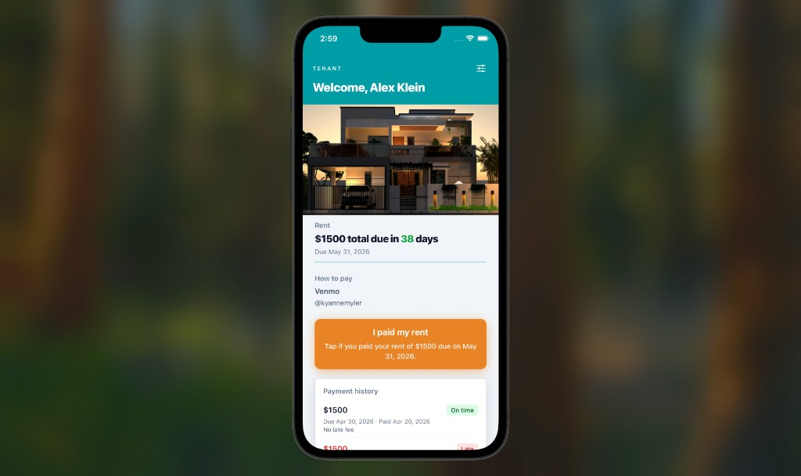

# Rent Squirrel

## About the project

**Rent Squirrel** is a cross-platform rental management app for **landlords**, **tenants**, and **maintenance workers**. It helps small landlords and renters coordinate the full rental lifecycle in one place: listing and managing properties, submitting and reviewing applications, viewing lease details, recording rent (including late-fee awareness), and filing maintenance requests with optional photos.

The app is built with **Expo** and **React Native** so a single codebase runs on **iOS**, **Android**, and **web**. Data and authentication are backed by **Supabase** (PostgreSQL, Auth, Row Level Security, RPC functions, and Storage for uploads). Role-specific dashboards keep each user type focused on the tasks that matter to them.

## Screenshot

Tenant dashboard: welcome header, property image, current rent due, landlord payment instructions (e.g. Venmo), **I paid my rent** action, and payment history.



## Stack

| Layer | Technology |
|--------|------------|
| App | [Expo](https://expo.dev) ~54, [Expo Router](https://docs.expo.dev/router/introduction/) (file-based routes), React Native, TypeScript |
| Backend | [Supabase](https://supabase.com) — PostgreSQL, Auth, Row Level Security, RPCs, Storage |
| Client DB access | `@supabase/supabase-js` |

Database schema and policies live in your **Supabase project** (Dashboard or any migrations you keep outside this repo). Optional dummy data: `scripts/seed_dummy_data.sql`.

## Requirements

- **Node.js** 20 or newer  
- **npm** (or compatible package manager)  
- A **Supabase** project with schema and policies already applied

## Setup

1. **Clone and install**

   ```bash
   git clone <your-repo-url>
   cd <project-directory>
   npm install
   ```

2. **Environment**

   Create a `.env` file in the project root:

   ```env
   EXPO_PUBLIC_SUPABASE_URL=https://<your-project>.supabase.co
   EXPO_PUBLIC_SUPABASE_ANON_KEY=<your-anon-key>
   ```

   Expo loads these for client-side Supabase access. For production web (e.g. Vercel), set the same variables in the host’s environment settings.

3. **Start the dev server**

   ```bash
   npm start
   ```

   Then open in Expo Go, an iOS/Android simulator, or press `w` for web.

## Scripts

| Command | Purpose |
|---------|---------|
| `npm start` | Start Expo dev server |
| `npm run web` | Dev server with web target |
| `npm run ios` / `npm run android` | Run on simulator/device (native tooling required) |
| `npm run build` | Static web export (`expo export --platform web`, output in `dist/`) |
| `npm run lint` | ESLint (Expo config) |
| `npm run reset-project` | Expo starter reset (moves `app` to `app-example`; only if you intend to use it) |

## Project layout

- **`app/`** — Screens and navigation (`_layout.tsx`, role-based areas under `landlord/`, `tenant/`, `maintenance/`)
- **`contexts/`** — React context (e.g. auth, theme)
- **`lib/`** — Supabase client, helpers, theme
- **`components/`** — Shared UI
- **`scripts/`** — Utilities and optional SQL seeds (e.g. `seed_dummy_data.sql`)

## Web production build

Web is configured for **static export** (`app.json` → `web.output: "static"`). Deploy the `dist/` folder (for example with a host that serves static files and your chosen env vars). Do not point a single-page `rewrite` to `/` unless you switch to SPA output, or deep links to routes will break.

## License

Private / academic use per your course or team policy.
